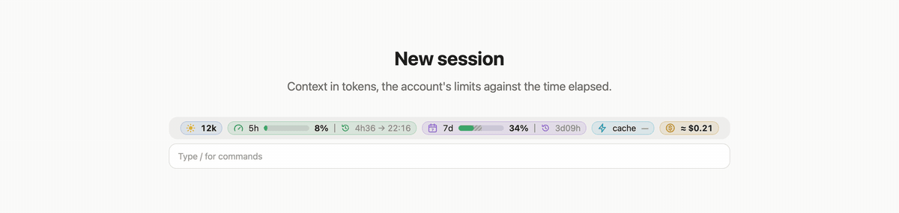
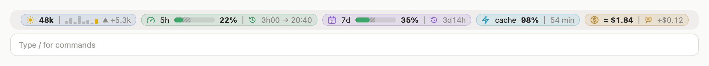
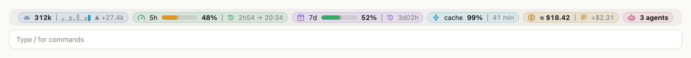
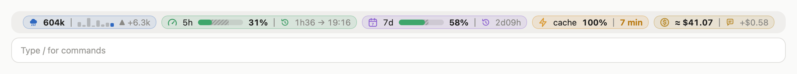
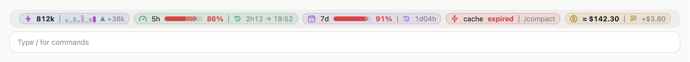

# claude-mods

[Claude Code](https://claude.dev/blog/getting-started-with-claude-code-mods/) mods by Eric Cologni.

## token-weather-usage

Stop hitting your Claude limit by surprise. One band above the prompt shows how big your context is, your 5-hour and weekly limits against the clock, whether the prompt cache is still warm, what the session and the last prompt cost, and which agents are running.



### Four situations

**All clear.** Small context, both limits behind the clock, the cache warm for almost an hour.



**Agents at work.** Three subagents running (hover their pill for their tasks); the 5-hour limit runs a little ahead of time, so its gauge turns yellow.



**Cache about to lapse.** Seven minutes left: send the next message now, or the whole 604k context gets written again at full price.



**Slow down.** Context near full, the 5-hour limit far ahead of time, the cache expired: `/compact` before going on.



### What each pill says

- **Context**: tokens in the context, with a weather icon from Clear to "Compact soon" (hover the pill for the weather and the share of the window). Then one bar per prompt for the last 5, as tall as the tokens it added, the current one in color, and the last prompt's change.
- **5h / 7d**: the share of your account's limits already used. The gap with the time elapsed is hatched: grey after the bar while you have margin, in the bar's color when you use faster than time passes. Green while usage does not run ahead of time; yellow beyond; red when more than 15 points ahead or past 90%. Then the time left; for the 5-hour limit, the reset time (machine's time zone) sits in the pill's hover card in the app and is left out in the terminal. A window that already reset is hidden until the next reading; the latest reading is shared across the sessions open on the machine.
- **Cache**: the time before the prompt cache lapses, behind a bolt in the app and the word "cache" in the terminal. When the last message read less than 90% of its prompt from the cache, that share comes first ("cache 64% · 52 min"). Each message restarts the clock: 1 hour on a Claude subscription, 5 minutes on an API key. Mods get the token counts but not the lifetime, so it follows Claude Code's rules and corrects itself from what the traffic shows. Yellow under 10 minutes, with what is at stake in dollars ("$2.32 at stake": the whole context written again if the cache lapses); "missed" with its cause (model changed, lapsed, start changed) when a message had to write the cache again, and what that cost above a message served by the cache ("+$2.10"); red "expired" once it lapsed, with what the next message writes again and its cost ("741k to rewrite ≈ $5.93"). From 100k tokens comes the way out: `/compact` up to 300k, a new thread beyond, since the next message would rewrite the whole context at full price, which a new thread avoids and a compaction would only read again. The terminal keeps that advice on the line ("· /compact", "· new thread"); the app puts it in the pill's hover card. In the app, hover the cache pill for the expiry time, the share of the last message read from the cache, what the context costs a message read from the cache against writing it again, and what the cache saved in this thread. The dollars come from Anthropic's list prices, dated 2026-09-25 (input, cache read, and cache writes at 1.25× input for 5 minutes or 2× for 1 hour); on a subscription they are API-price equivalents, hence the "≈". A model missing from the price table shows tokens only. A compaction updates the band at once, without waiting for the next prompt: the context drops to its new size, and the cache reads "compacted" until the next message writes a new one, which is not counted as a miss.
- **Cost**: what the session cost, as `/cost` totals it (cents dropped from $100), and what the last prompt added (its subagents included), in dollars and in points of the 5-hour limit ("+$1.07 · +2.5% 5h"; the limit is the account's, so other sessions running at the same time count in it). On a subscription the dollars are the API-price equivalent, not a bill, hence the "≈".
- **Agents**: shown only while subagents run; hover the pill for the type and task of each. Background shell commands are not counted (Claude Code does not expose them to mods).

In the desktop app each block is a tinted pill with its icon, and a pill never shrinks to fit. In the app, each pill shows its details in a card above the band while the pointer is over it. In the terminal the same blocks sit on one line, split by a thin rule:

```
☂ 634k ▃▄▂█▆ ▲ +6.3k │ 5h ━━━━╍─ 74% · 24 min │ 7d ━━━━── 65% · 2d20h │ cache 52 min │ ≈ $41.07 (+$0.58 · +1.5% 5h) │ 2 agents
```

When the line does not fit the terminal, the bars, details and cost drop out, leaving labels and percentages.

### Language

Labels are in English or French. By default (`auto`) the mod follows `LC_ALL`, `LC_MESSAGES` or `LANG` and falls back to English. The desktop app often sets none of them: pick `en` or `fr` in the plugin's **Language** option in `/config`.

### Install

```
/plugin marketplace add augiefra/claude-mods
/plugin install token-weather-usage@augiefra-mods
/reload-plugins
```

If the line does not show up, restart Claude Code. A mod is code that runs inside Claude Code with the same access as Claude Code: read it before installing. This one is a single file, [token-weather-usage.mjs](plugins/token-weather-usage/hooks/token-weather-usage.mjs).

### Check

```
claude plugin validate ./plugins/token-weather-usage
claude plugin test ./plugins/token-weather-usage
```

## Privacy

token-weather-usage collects, sends and retains no personal data. It only reads the usage figures Claude Code provides (context fill, 5-hour and 7-day limits, session cost, each request's cache token counts), the list of the session's subagents, the locale variables above and the prompt-cache switches (`DISABLE_PROMPT_CACHING`, `FORCE_PROMPT_CACHING_5M`, `CLAUDE_CODE_PROMPT_CACHE_TTL`, `ENABLE_PROMPT_CACHING_1H`). It keeps in the plugin's local storage, on the machine, the latest limits reading and, per session, recent context readings, the last request's cache figures, what the cache saved in the session and the last prompt's cost (deleted after 8 idle days). No network requests.

## Credits

- The context weather, the tokens and the turns chart come from Anthropic's **Token Weather** example ([claude-code-playground](https://github.com/anthropics/claude-code-playground), Apache-2.0).
- The limit gauges are inspired by HolyGrail's **usage-meter** ([HolyGrail/claude-mods](https://github.com/HolyGrail/claude-mods/tree/main/plugins/usage-meter)). They were written for this mod after usage-meter (same idea: gauges with an elapsed-time marker, a reading shared across sessions), without copying its code.
- The cache block is inspired by Daniel San's **prompt-cache-control** ([davila7/claude-code-templates](https://github.com/davila7/claude-code-templates), MIT). It was written for this mod after it (same idea: cache usage per request, an inferred lifetime, a countdown), without copying its code.

## License

Apache-2.0, see [LICENSE](LICENSE) and [NOTICE](NOTICE).
