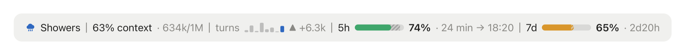
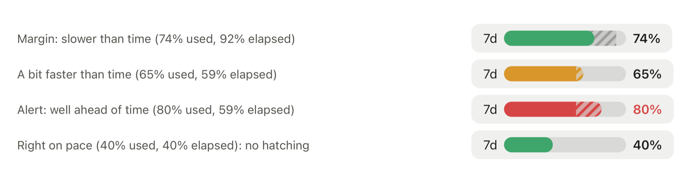

# claude-mods

[Claude Code](https://claude.dev/blog/getting-started-with-claude-code-mods/) mods by Eric Cologni.

## token-weather-usage

Stop hitting your Claude limit by surprise. One line above the prompt shows your 5-hour and weekly limits against the clock, how full your context is, and what each prompt cost.

In the desktop app:



In the terminal:

```
☂ Showers │ 63% context · 634k/1M │ turns ▃▆▂█▃▄▂▆ ▲ +6.3k │ 5h ━━━━━━╍─ 74% · 24 min → 18:20 │ 7d ━━━━━─── 65% · 2d20h
```

- **5h / 7d**: the share of your account's limits already used. The gap with the time elapsed in the window is hatched: grey after the bar while you have margin, in the bar's color when you use faster than time passes.
  Green while usage does not run ahead of time; yellow beyond; red when more than 15 points ahead or past 90%.
  The percentage stays in the text color, red only on alert. Then the time left and, for the 5-hour limit, the reset time (machine's time zone).
  A window that already reset is hidden until the next reading. The latest reading is shared across the sessions open on the machine.

  

- **Context weather**: from Clear to "Compact soon", by the share of the context window in use. Icons drawn in the app (sun, cloud, showers, lightning, zigzag), Unicode symbols in the terminal.
- **Context**: percentage and tokens used out of the window.
- **Turns**: one bar per prompt for the last 8, as tall as the tokens it added (the heaviest prompt fills the height); the current prompt in color, earlier ones in grey. Then the last prompt's change. Shown from the second prompt on, and kept across restarts.

Gauges and bars are drawn as SVG in the desktop app and as characters in the terminal. When the line does not fit the terminal, the bars and details drop out, leaving labels and percentages.

### Language

Labels are in English or French. By default (`auto`) the mod follows `LC_ALL`, `LC_MESSAGES` or `LANG` and falls back to English. The desktop app often sets none of them: pick `en` or `fr` in the plugin's **Language** option in `/config`.

### Install

```
/plugin marketplace add augiefra/claude-mods
/plugin install token-weather-usage@augiefra-mods
/reload-plugins
```

If the line does not show up, restart Claude Code. A mod is code that runs inside Claude Code with the same access as Claude Code: read it before installing. This one is a single file, [token-weather-usage.mjs](plugins/token-weather-usage/hooks/token-weather-usage.mjs).

### Check

```
claude plugin validate ./plugins/token-weather-usage
claude plugin test ./plugins/token-weather-usage
```

## Privacy

token-weather-usage collects, sends and retains no personal data. It only reads the usage figures Claude Code provides (context fill, 5-hour and 7-day limits) and the locale variables above, and keeps in the plugin's local storage, on the machine, the latest limits reading and, per session, recent context readings (deleted after 8 idle days). No network requests.

## Credits

- The context weather, the tokens and the turns chart come from Anthropic's **Token Weather** example ([claude-code-playground](https://github.com/anthropics/claude-code-playground), Apache-2.0).
- The limit gauges are inspired by HolyGrail's **usage-meter** ([HolyGrail/claude-mods](https://github.com/HolyGrail/claude-mods/tree/main/plugins/usage-meter)). They were written for this mod after usage-meter (same idea: gauges with an elapsed-time marker, a reading shared across sessions), without copying its code.

## License

Apache-2.0, see [LICENSE](LICENSE) and [NOTICE](NOTICE).
