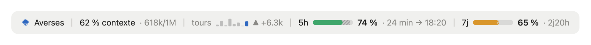
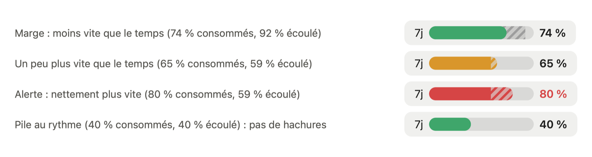

# claude-mods

Mods pour [Claude Code](https://claude.dev/blog/getting-started-with-claude-code-mods/), par Eric Cologni.

## token-weather-usage

Une ligne au-dessus du prompt, dans l'app de bureau :



Et dans le terminal :

```
☁ Nuageux │ 44 % contexte · 440k/1M │ tours ▃▆▂█▃▄▂▇ ▲ +8.4k │ 5h ━━━╍╍╍── 37 % · 2h22 → 18:20 │ 7j ━━━━╍─── 60 % · 2j23h
```

- **Météo du contexte** : de Clair à « Compacter bientôt », selon la part de la fenêtre de contexte utilisée. Icônes dessinées dans l'app (soleil, nuage, averse, éclair, zigzag), symboles Unicode dans le terminal.
- **Contexte** : pourcentage et tokens utilisés sur la fenêtre.
- **Tours** : une barre par prompt sur les 8 derniers, de hauteur égale aux tokens ajoutés (le prompt le plus lourd remplit la hauteur) ; le prompt actuel en couleur, les précédents en gris. Puis l'écart du dernier prompt. Affiché à partir du deuxième prompt, et conservé après un redémarrage.
- **5h / 7j** : part consommée des limites du compte. L'écart avec le temps écoulé de la fenêtre est hachuré : en gris après la barre quand il reste de la marge, dans la couleur de la barre quand on consomme plus vite que le temps.
  Vert tant que la consommation ne va pas plus vite que le temps ; jaune au-delà ; rouge à plus de 15 points d'avance ou à partir de 90 %.
  Le pourcentage reste dans la couleur du texte, en rouge seulement en alerte. Puis le temps restant, et pour la limite 5 h l'heure de remise à zéro (heure de Paris).
  Une fenêtre déjà remise à zéro est masquée jusqu'à la mesure suivante.
  La dernière mesure est partagée entre les sessions ouvertes sur la machine.

  

Jauges et barres sont dessinées en SVG dans l'app de bureau et en caractères dans le terminal. Si la ligne ne tient pas dans le terminal, les barres et le détail s'effacent ; il reste le libellé et le pourcentage.

*English: a one-line band above the prompt with context "weather", context tokens, per-prompt token bars, and your 5-hour and 7-day usage limits, where the gap with elapsed time is hatched. Labels are in French.*

### Installer

```
/plugin marketplace add augiefra/claude-mods
/plugin install token-weather-usage@augiefra-mods
/reload-plugins
```

Si la ligne n'apparaît pas, redémarrer Claude Code. Un mod est du code qui tourne dans Claude Code avec les mêmes accès que lui : relisez-le avant de l'installer.

### Vérifier

```
claude plugin validate ./plugins/token-weather-usage
claude plugin test ./plugins/token-weather-usage
```

## Confidentialité

token-weather-usage ne collecte, n'envoie ni ne conserve aucune donnée personnelle. Il lit seulement les chiffres d'usage que Claude Code lui fournit (remplissage du contexte, limites 5 h et 7 jours) et garde dans le stockage local du plugin, sur la machine, la dernière mesure des limites et, par fil, les derniers relevés de contexte (effacés après 8 jours d'inactivité). Aucune requête réseau.

*Privacy: the mod collects, sends and retains no personal data. It only reads the usage figures Claude Code provides and keeps the latest limits reading and, per session, recent context readings (deleted after 8 idle days) in the plugin's local storage. No network requests.*

## Crédits

- La météo du contexte, les tokens et le graphique des tours viennent de l'exemple **Token Weather** d'Anthropic ([claude-code-playground](https://github.com/anthropics/claude-code-playground), Apache-2.0).
- Les jauges de limites s'inspirent de **usage-meter** de HolyGrail ([HolyGrail/claude-mods](https://github.com/HolyGrail/claude-mods/tree/main/plugins/usage-meter)). Elles ont été écrites pour ce mod d'après usage-meter (même idée : jauges avec repère du temps écoulé, mesure partagée entre sessions), sans copie de son code.

## Licence

Apache-2.0, voir [LICENSE](LICENSE) et [NOTICE](NOTICE).
